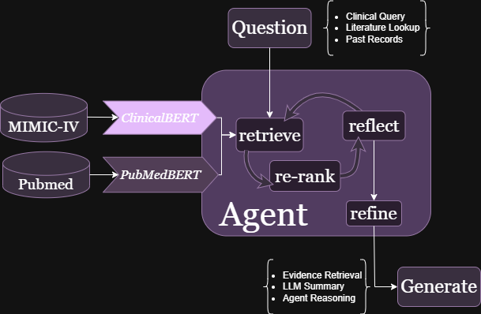

# Agentic Biomedical Retrieval System (ABRS)
<p align="center">
  
</p>

<p align="center">
  <a href="#run-the-api"></a>
  <a href="#environment-setup-cuda-129"></a>
  <a href="LICENSE"></a>
  <a href="#evaluation-patientpatient-retrieval-ppr"></a>
</p>

---

<details open>
<summary><h2>Abstract</h2></summary>
We propose an agentic RAG framework for biomedical evidence retrieval that uses iterative query refinement across PubMed and MIMIC-IV clinical notes. Using dual domain-specific encoders and self-critique loops, our system achieves competitive results on PMC-Patients and PubMedQA benchmarks, demonstrating the value of adaptive retrieval for clinical decision support.
</details>

---

<p align="center">
  
</p>

**Figure 1.** Hybrid biomedical RAG with iterative self-critique.
Evidence from PubMed (literature) and MIMIC-IV (clini-
cal notes) is retrieved via domain-specific encoders and re-
ranked. An agent cycles between reflect and refine, yielding
a final, evidence-grounded response.

---

<details open>
<summary><h2>Key Features</h2></summary>

- **Multi-model biomedical encoders (GPU):** e.g., SapBERT, BioBERT, MiniLM baseline.  
- **Hybrid re-ranking:** `score = α·embed + β·keyword + γ·phrase − δ·off_topic`, with **MMR(λ)** diversity.  
- **Agent loop (optional):** LLM synthesizes answer solely from evidence; verifier requests new terms if support is weak, then re-retrieve.  
- **Clean API:** Ingestion (`/load_csv`, `/load_json`), retrieval (`/search`, `/search_batch`), and agentic QA (`/query`).  
- **Reproducible evaluation:** **PPR** on **PMC-Patients** with **MRR@k, nDCG@k, P@k, R@k**; batched calls, CSV logging.  
- **Robust ingestion:** CSV repair for malformed quotes/newlines; JSON loader for PMC-Patients.
</details>

---

 <details open>
<summary><h2>Files & Folders</h2></summary>

The JDRE repository is organized as follows:

#### 🧬 `Data`

Contains all biomedical and graph-based datasets used for retrieval, training, and evaluation.

| File / Folder | Description |
|----------------|-------------|
| **`Agent/`** | Directory for the reproducible Agentic RAG code files. |
| **`Data/`** | Directory for **original dataset dumps** (e.g., PMC-Patients, MIMIC-style notes). |
| **`requirements.txt`** | Module Download Kit. |

---
#### 🧠 `Agent`

Core implementation of the **Agentic Biomedical Retrieval Framework**, responsible for orchestrating ingestion, retrieval, reflection, and evaluation processes.

| File | Description |
|------|--------------|
| **`app.py`** | FastAPI entry point — initializes routes for ingestion (`/load_csv`, `/load_json`), retrieval (`/search`, `/query`), and evaluation. |
| **`document_store.py`** | Manages the in-memory and persistent storage of biomedical documents, embeddings, and FAISS indices. |
| **`generation.py`** | Optional **LLM synthesis and reflection** module — generates natural language answers from retrieved evidence and performs self-verification loops. |
| **`load_pmc_to_api.py`** | Preprocessing and ingestion script to load PMC-Patients dataset or user-provided files into the API’s backend. |
| **`rag_config.py`** | Central configuration file — defines paths, weights (α, β, γ, δ), model selection, and reflection parameters. |
| **`repair_csv_quotes.py`** | Utility to automatically clean malformed or corrupted CSV files (e.g., quote mismatches) before ingestion. |
| **`retrieval.py`** | Core retrieval logic — performs **multi-BERT embedding generation**, **FAISS vector search**, and **hybrid ranking** using MMR. |
| **`schemas.py`** | Defines Pydantic data models and response structures for API requests and results (documents, embeddings, metrics, etc.). |


</details>

&nbsp;

 <details open>
<summary><h2>Dataset Description</h2></summary>

Contains all **input datasets** required for biomedical retrieval, indexing, and evaluation — including both user-provided MIMIC-style notes and the public **PMC-Patients** benchmark dataset.

| Dataset | Description |
|----------|--------------|
| **MIMIC-style Clinical Notes (Custom Data)** | User-provided clinical or biomedical notes in **CSV** format. Used for custom indexing and retrieval experiments. |
| **Fields Required:** | |
| `HADM_ID` | Unique hospital admission ID or record identifier. |
| `TEXT` | Free-form clinical note text (can be long; supports multiple paragraphs). |
| `CONTEXT` | Optional short descriptor such as note section, title, or summary context. |
| **Example File:** | `mimic_notes.csv` |
| **Usage:** | Ingest via API endpoints `/load_csv` or `/index` for embedding and FAISS index creation. |

---

| Dataset | Description |
|----------|--------------|
| **PMC-Patients (Evaluation Benchmark)** | Benchmark dataset for **Patient→Patient Retrieval (PPR)** evaluation. Used to assess retrieval quality across biomedical queries. |
| **File:** | `PMC-Patients.json` — structured as a list of patient entries (JSON dicts). |
| **Fields:** | |
| `patient_uid` | Unique patient identifier (e.g., `"PMID-3"`). |
| `patient` | The main patient description or biomedical text (serves as the query). |
| `title` | Optional context or title for the patient record. |
| `similar_patients` | Dictionary mapping related patient UIDs to relevance labels: `{ "PMID-5": 1, "PMID-12": 2 }`. |
| **Download:** | Available via [Figshare](https://figshare.com/) or [HuggingFace Datasets](https://huggingface.co/) — *no usage agreement required*. |
| **Usage:** | Used directly for `/search_batch` evaluations and computing metrics (**MRR@k**, **nDCG@k**, **Precision@k**, **Recall@k**). |

</details>

&nbsp;

<details open>
<summary><h2>Environment Setup (CUDA 12.9)</h2></summary>

> **Target Environment:** RunPod / RTX 5090 / CUDA 12.9 wheels  
> **Note:** FAISS uses **CPU** via `pip`. For **GPU FAISS**, install via `conda`.

---

### 🧹 0) Clean Conflicting Installs
Before setting up, remove any existing Torch or FAISS installations to prevent CUDA mismatch errors.

```bash
pip uninstall -y torch torchvision torchaudio torchtext faiss-gpu faiss-cpu || true
```

### 🔥 1) Install PyTorch (CUDA 12.9)

Use the official PyTorch wheels compiled for **CUDA 12.9**.

```bash
pip install --upgrade torch torchvision --index-url https://download.pytorch.org/whl/cu129
```

### 🧩 2) Core Dependencies

Install core dependencies for the Agentic Biomedical Retrieval System.

```bash
pip install -U \
  faiss-cpu \
  fastapi uvicorn[standard] pydantic \
  pandas numpy requests \
  sentence-transformers "transformers>=4.41" \
  openai tiktoken python-multipart
```

### 🧬 Optional (for SciSpaCy-based Biomedical NER)

If your setup requires biomedical entity recognition using en_core_sci_md, install SciSpaCy and the model package:

```bash
pip install scispacy
pip install https://s3-us-west-2.amazonaws.com/ai2-s2-scispacy/releases/v0.5.4/en_core_sci_md-0.5.4.tar.gz
```

### 🧠 Sanity Check

Verify that both Torch and FAISS are properly installed and compatible with CUDA.

```bash
python - << 'PY'
import torch, faiss
print("Torch:", torch.__version__, "CUDA:", torch.cuda.is_available())
print("FAISS:", faiss.__version__)
PY
```

### 🧾 Helpful Environment Toggles

These environment variables can help reduce warnings and avoid unnecessary dependencies:

```bash
export TRANSFORMERS_NO_TORCHVISION=1
export TOKENIZERS_PARALLELISM=false
```
</details>

&nbsp;

<details open>
<summary><h2>Configuration</h2></summary>

All configuration parameters for the **Agentic Biomedical Retrieval System** are managed in the file **`rag_config.py`**.

You can edit this file directly or (recommended) use **environment variables** for sensitive keys and deployment setups.

---

### 🧩 Example: `rag_config.py`

```python
# =========================
#  rag_config.py
# =========================

# 🔑 API Key
# Prefer reading from environment variables for security:
# os.environ["OPENAI_API_KEY"]
OPENAI_API_KEY = "REPLACE_WITH_YOUR_OPENAI_KEY"   # or use environment variable

# 🧠 Embedding Ensemble
# Specify multiple biomedical embedding models (comma-separated)
EMBED_MODEL_NAMES = "cambridgeltl/SapBERT-from-PubMedBERT-fulltext, pritamdeka/S-BioBert-snli-multinli-stsb"

# 🧱 Chunking Parameters
# Controls text segmentation for embeddings
CHUNK_SIZE = 1200
CHUNK_OVERLAP = 200

# ⚖️ Hybrid Scoring Weights
# Scoring formula: α·embed + β·keyword + γ·phrase − δ·off_topic
ALPHA_EMBED    = 0.72
BETA_KEYWORD   = 0.25
GAMMA_PHRASE   = 0.12
DELTA_OFFTOPIC = 0.25
MMR_LAMBDA     = 0.70
```

> ⚠️ **Security Notice**  
> Hardcoding API keys directly into source files (like `rag_config.py`) is convenient for quick experiments,  
> but **unsafe** for shared or public repositories.  
> Always prefer using **environment variables** or a **`.env` file** for production deployments.
>
> **Recommended Practice:**
> ```bash
> export OPENAI_API_KEY="your_api_key_here"
> ```
>
> **Then access it in code:**
> ```python
> import os
> OPENAI_API_KEY = os.getenv("OPENAI_API_KEY")
> ```
>
> This approach keeps your credentials secure, prevents accidental exposure,  
> and allows easier deployment on remote systems (RunPod, Docker, etc.).
</details>

&nbsp;

<details open>
<summary><h2>Running the API</h2></summary>

From the root folder containing **`app.py`**, launch the FastAPI server using **Uvicorn**:

```bash
uvicorn app:app --host 0.0.0.0 --port 8000 --reload
```

### 🩺 Health Check

Verify that the API is running correctly by calling the **`/health`** endpoint:

```bash
curl -s http://127.0.0.1:8000/health | python -m json.tool
```

### ✅ Expected Output
```bash
{
  "status": "ok",
  "device": "cuda",
  "models": ["cambridgeltl/SapBERT-from-PubMedBERT-fulltext", "pritamdeka/S-BioBert-snli-multinli-stsb"]
}
```
</details>

&nbsp;

<details open>
<summary><h2>API Endpoints</h2></summary>

Below are the main **FastAPI endpoints** exposed by the **Agentic Biomedical Retrieval System**.  
Each endpoint handles ingestion, retrieval, and reflection tasks for biomedical text data.

---

### 🩺 `GET /health`
**Description:**  
Returns current server status, available device (CPU/GPU), and loaded models.

**Example:**
```bash
curl -s http://127.0.0.1:8000/health | python -m json.tool
```

Below are the main **FastAPI endpoints** exposed by the **Agentic Biomedical Retrieval System**.  
Each endpoint handles ingestion, retrieval, and reflection tasks for biomedical text data.

---

### 📥 `POST /load_csv (multipart)`
**Purpose:**  
Upload and embed MIMIC-style clinical notes directly from a CSV file.
Automatically preprocesses, chunks, embeds (on GPU), builds FAISS index (CPU), and caches results.

**Example:**
```bash
curl -X POST "http://127.0.0.1:8000/load_csv?text_col=TEXT&context_col=CONTEXT&id_col=HADM_ID&chunk_size=1200&chunk_overlap=200" \
  -H "Content-Type: multipart/form-data" \
  -F "file=@/workspace/final_notes_clean.csv"
```

### 🧾 `POST /load_json (application/json)`
**Purpose:**  
Load structured biomedical data (e.g., PMC-Patients) via JSON body.

**Request Body:**
```bash
{
  "rows": [
    {"patient": "text entry ...", "patient_uid": "PMID-3", "title": "context ..."},
    {"patient": "another record ...", "patient_uid": "PMID-5", "title": "context ..."}
  ],
  "text_col": "patient",
  "context_col": "title",
  "id_col": "patient_uid",
  "chunk_size": 1200,
  "chunk_overlap": 200
}
```

### 🔍 `POST /search (retrieval-only)`
**Purpose:**  
Perform dense retrieval over indexed biomedical text without LLM reflection.
Ideal for PPR evaluation or large-scale benchmark runs.

**Request Body:**
```bash
{
  "query": "text",
  "top_k": 10,
  "final_k": 10,
  "exclude_id": "OPTIONAL_ID"
}
```

**Response:**
Returns a ranked list of candidate documents.
```bash
[
  {"id": "HADM_234", "context": "Discharge summary...", "score": 0.914},
  {"id": "HADM_235", "context": "Clinical note...", "score": 0.891}
]
```

### 🔁 `POST /search_batch`
**Purpose:**  
Batch retrieval for multiple queries — used for Patient→Patient Retrieval (PPR) experiments.

**Request Body:**
```bash
{
  "queries": [
    {"text": "query_1 text", "exclude_id": "PMID-3"},
    {"text": "query_2 text"}
  ],
  "top_k": 10,
  "final_k": 10
}
```

**Response:**
Returns a list of ranked lists, one per query.
```bash
[
  [ {"id": "PMID-5", "score": 0.89}, {"id": "PMID-6", "score": 0.86} ],
  [ {"id": "PMID-9", "score": 0.91}, {"id": "PMID-10", "score": 0.88} ]
]
```

### 💬 `POST /query`
**Purpose:**  
Performs full agentic retrieval — embedding search, hybrid re-ranking, and optional LLM reflection.

**Request Body:**
```bash
{
  "query": "red skin after antibiotics",
  "top_k": 16,
  "final_k": 5,
  "reflect": true
}
```

**Response:**
Returns a list of ranked lists, one per query.
```bash
{
  "expand": ["erythema after antibiotic use", "rash following antibiotic therapy"],
  "candidates": [...],
  "answer": "This may represent a hypersensitivity reaction...",
  "refined": "antibiotic-induced erythema"
}
```

> 💡 **Tips**  
> Use **`/search`** for deterministic retrieval during evaluation.
> 
> Use **`/query`** for agentic reflection mode, where the system generates and refines answers dynamically.
</details>

&nbsp;

<details open>
<summary><h2>Indexing the Notes</h2></summary>

### 1) (Optional) Repair malformed CSV
Broken quotes or truncated lines can break `pandas`. Use the repair script first:

```bash
python repair_csv_quotes.py /workspace/final_notes.csv /workspace/final_notes_clean.csv
```

### 2) Load into the API & build indices
Upload your cleaned CSV, then the API will preprocess → chunk → embed (GPU) → build FAISS (CPU):

```bash
curl -X POST "http://127.0.0.1:8000/load_csv?text_col=TEXT&context_col=CONTEXT&id_col=HADM_ID&chunk_size=1200&chunk_overlap=200" \
  -H "Content-Type: multipart/form-data" \
  -F "file=@/workspace/final_notes_clean.csv"
```
✅ After this completes, embeddings are cached and FAISS indices are ready for search.
</details>

&nbsp;

<details open>
<summary><h2>Querying & Agent Loop</h2></summary>

### 1) Retrieval-only (debugging / benchmarking)
Deterministic dense retrieval with hybrid ranking; ideal for PPR/metrics:

```bash
curl -s -X POST http://127.0.0.1:8000/search \
  -H 'Content-Type: application/json' \
  -d '{"query":"adult with diffuse erythematous rash post-antibiotics","top_k":10,"final_k":10}' \
| python -m json.tool
```

### 2) Agentic QA with reflection
Full pipeline: retrieval → re-rank → LLM synthesis → (optional) reflection & refinement:

```bash
curl -s -X POST http://127.0.0.1:8000/query \
  -H "Content-Type: application/json" \
  -d '{"query":"red skin after antibiotics","top_k":16,"final_k":5,"reflect":true}' \
| python -m json.tool
```

> 💡 **Tips**  
> Use **`/search`** while tuning models/weights (α, β, γ, δ, MMR_LAMBDA) for reproducible metrics.
> 
> Use **`/query`** when you want agentic expansions, synthesized answers, and iterative refinement.
</details>

&nbsp;
<details open>
<summary><h2>Evaluation: Patient→Patient Retrieval (PPR)</h2></summary>

We provide a **loader** and an **evaluator** to benchmark retrieval quality on **PMC-Patients** using standard IR metrics.

---

### A) Load PMC-Patients into the API

Indexes PMC-Patients by mapping:
- `patient` → **text**
- `patient_uid` → **id**
- `title` → **context**

```bash
python load_pmc_to_api.py \
  --json /workspace/PMC-Patients.json \
  --limit 20000 \
  --batch 4000
```

### B) Evaluate (MRR@k, nDCG@k, P@k, R@k)
Runs Patient→Patient Retrieval using the API and computes per-query + summary metrics.

```bash
python evaluate_ppr.py \
  --json /workspace/PMC-Patients.json \
  --k 10 \
  --limit 5000 \
  --batch 64 \
  --out_csv ppr_results.csv
```

**Behaviour**
- Uses **`/search_batch`** (falls back to **`/search`** if batching unavailable).
- Excludes self-hits (the query’s own **`patient_uid`**).
- Produces **`ppr_results.csv`** with per-query metrics and prints an aggregate summary.

</details>

&nbsp;
<details open>
<summary><h2>Appendix: Quick Commands</h2></summary>

A concise set of commands to get your **Agentic Biomedical Retrieval System** up and running quickly.

---

### 🚀 Start API
Launch the FastAPI backend with live reload enabled:
```bash
uvicorn app:app --host 0.0.0.0 --port 8000 --reload
```
### 🩺 Health Check
Verify that the API is running and confirm available devices and models:
```bash
curl -s http://127.0.0.1:8000/health | python -m json.tool
```
### 🧾 Index MIMIC-style CSV
Ingest and index your clinical notes (MIMIC-style) from CSV:
```bash
curl -X POST "http://127.0.0.1:8000/load_csv?text_col=TEXT&context_col=CONTEXT&id_col=HADM_ID&chunk_size=1200&chunk_overlap=200" \
  -H "Content-Type: multipart/form-data" \
  -F "file=@/workspace/final_notes_clean.csv"
```
### 💬 Query (Agentic Mode)
Perform full agentic retrieval — multi-model search, reflection, and answer synthesis:
```bash
curl -s -X POST http://127.0.0.1:8000/query \
  -H "Content-Type: application/json" \
  -d '{"query":"red skin after antibiotics","top_k":16,"final_k":5,"reflect":true}' \
| python -m json.tool
```
### 🧬 Load PMC-Patients JSON
Load and index the PMC-Patients benchmark dataset for PPR evaluation:
```bash
python load_pmc_to_api.py --json /workspace/PMC-Patients.json --limit 20000 --batch 4000
```
### 📈 Evaluate PPR
Run Patient→Patient Retrieval evaluation and export results:
```bash
python evaluate_ppr.py --json /workspace/PMC-Patients.json --k 10 --limit 5000 --batch 64 --out_csv ppr_results.csv
```
</details>

&nbsp;
<details open>
<summary><h2>Citation</h2></summary>

Will be updated soon !!
</details>

&nbsp;
